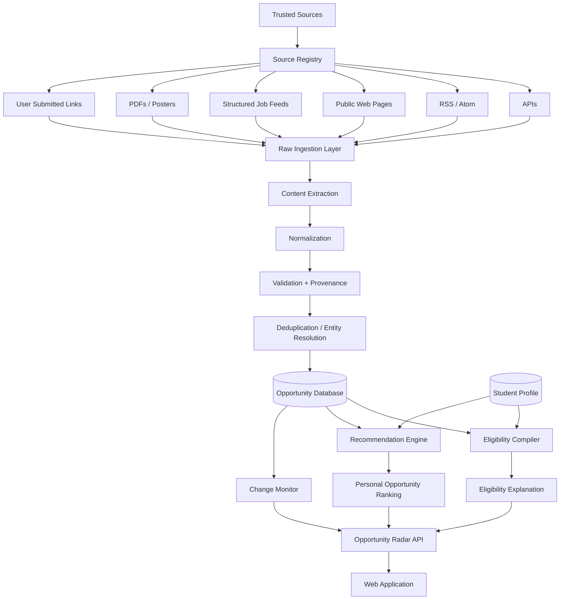

# Opportunity Radar

> **A Personal Opportunity Intelligence System for students — built to discover, verify, understand, prioritize, and track opportunities across the web.**


---

## Overview

**Opportunity Radar** is an AI-powered student opportunity intelligence platform designed to solve a problem that most opportunity portals only partially address:

> Students do not just need *more listings*. They need help finding the **right opportunities**, understanding whether they are **actually eligible**, knowing **what they are missing**, and acting before the deadline.

Opportunities are currently fragmented across company career pages, university websites, research-lab pages, government portals, scholarship pages, hackathon platforms, college notices, newsletters, PDFs, posters, emails, and other sources.

Opportunity Radar is designed to bring these scattered sources into one intelligent workflow.

Instead of functioning only as another job board, the long-term goal is to become a **personal opportunity intelligence layer** that continuously discovers opportunities, verifies their source, converts eligibility requirements into structured rules, matches them against a student's profile, identifies readiness gaps, monitors changes, and helps the student move from discovery to application.

---

## The Problem

Students regularly face five major problems when searching for opportunities:

1. **Fragmentation**  
   Internships, hackathons, scholarships, fellowships, research openings, competitions, workshops, and conferences are spread across dozens of platforms and websites.

2. **Eligibility confusion**  
   Important requirements are buried inside long webpages, PDFs, circulars, or posters.

3. **Information overload**  
   Traditional platforms often present large feeds without explaining which opportunities are genuinely relevant to a particular student.

4. **Missed deadlines and changing information**  
   Deadlines, eligibility rules, locations, and application details may change after an opportunity is first discovered.

5. **No readiness guidance**  
   Finding an opportunity does not answer the next question:

   > *“Am I ready for this, and if not, what can I realistically improve before the deadline?”*

Opportunity Radar is being designed around these gaps.

---

# Core Idea

Opportunity Radar follows a simple philosophy:

> **Discover → Verify → Understand → Match → Prepare → Apply → Track**

A student should be able to move from an unknown opportunity somewhere on the web to an informed application decision without manually searching through multiple sources.

---

# Key Differentiators

## 1. Universal Opportunity Discovery

Opportunity Radar is designed to discover opportunities from multiple legitimate sources rather than relying only on opportunities posted directly to one platform.

Potential sources include:

- Official company career pages
- University and research-lab websites
- Government portals
- Scholarship and fellowship portals
- Hackathon and competition platforms
- Conference and workshop websites
- College placement notices
- Public RSS / Atom feeds
- Public APIs
- Public structured job feeds
- User-submitted URLs
- PDFs
- Posters and screenshots
- Forwarded announcements
- Newsletters and emails, where explicitly connected by the user

The system then converts these sources into a common structured opportunity format.

---

## 2. Evidence-Backed Eligibility Compiler

One of the core technical ideas behind Opportunity Radar is the **Eligibility Compiler**.

Instead of treating eligibility as unstructured text, the platform aims to convert requirements into machine-readable rules.

Example source text:

> “Open to B.Tech or B.E. students graduating in 2027 or 2028 with a minimum CGPA of 7.5 and no active backlogs.”

Possible structured representation:

```json
{
  "degrees": ["B.Tech", "B.E."],
  "graduation_years": [2027, 2028],
  "minimum_cgpa": 7.5,
  "active_backlogs": 0
}
```

The student's profile can then be evaluated against these rules.

Example result:

```text
✓ Degree requirement satisfied
✓ Graduation year satisfied
✓ CGPA requirement satisfied
✓ Backlog requirement satisfied
? Python proficiency mentioned, but profile evidence is missing
```

Every important eligibility conclusion should remain linked to the **original source evidence**.

The system should never invent eligibility rules.

---

## 3. Opportunity Gap Intelligence

Opportunity Radar should not stop at:

> “You are an 82% match.”

Instead, it should explain **why**.

Example:

```text
Opportunity: ML Research Internship

Satisfied
✓ Graduation year
✓ Degree
✓ CGPA
✓ Python

Missing / weak evidence
⚠ Deep-learning project evidence
⚠ PyTorch experience

Deadline
18 days remaining

Suggested preparation
→ Add an existing ML project to the resume
→ Complete the required application document
→ Review the listed technical prerequisites
```

The goal is to transform recommendation into **actionable readiness intelligence**.

---

## 4. Personal Opportunity Radar

The platform should gradually learn what opportunities are genuinely valuable to a student.

Signals may include:

- Skills
- Interests
- Degree
- Graduation year
- Career goals
- Preferred domains
- Opportunity views
- Saves
- Applications
- Ignores
- Completed opportunities
- User feedback

Over time, Opportunity Radar can build an evolving **Opportunity Preference Graph** rather than depending entirely on manually selected interests.

---

## 5. Personal Opportunity Scoring

Each opportunity can eventually be ranked using multiple signals rather than simple keyword similarity.

Conceptually:

```text
Opportunity Score =
    Eligibility
  + Skill Match
  + Career Goal Alignment
  + Interest Alignment
  + Deadline Urgency
  + Preparation Effort
  + Source Confidence
```

Example:

```text
Amazon ML Challenge
Personal Fit: 94/100

Why:
✓ Strong ML interest
✓ Relevant academic projects
✓ Eligible graduation year
✓ High relevance to career goal
⚠ Registration deadline approaching
```

The score must remain explainable.

---

## 6. Hidden Opportunity Discovery

Opportunity Radar is intended to surface valuable opportunities that students may never see on the major platforms.

Examples include:

- Professor research pages
- Research-lab openings
- University summer programs
- IIT / NIT announcements
- Government-funded fellowships
- Department notices
- Startup career pages
- Scholarship circulars
- Conference student programs
- PDF announcements
- College placement notices

This is where the term **Radar** becomes meaningful.

The product should not simply display what is already trending everywhere.

---

## 7. Change Monitoring

After an opportunity is discovered, the source may change.

Opportunity Radar is designed to eventually monitor authoritative sources for changes such as:

```text
Deadline changed
Sept 20 → Sept 25

Eligibility updated
2027 batch → 2027 / 2028 batch

Location updated
Bengaluru → Bengaluru / Hyderabad

Application status
Applications reopened
```

The platform should maintain source history instead of silently overwriting important information.

---

## 8. Duplicate Detection and Canonical Opportunities

The same opportunity may appear through:

- An official company page
- A college email
- A LinkedIn post
- A hackathon portal
- A forwarded PDF
- A placement notice

Opportunity Radar should attempt to identify these as the **same underlying opportunity**.

Instead of showing five duplicate entries:

```text
5 Sources
      ↓
Entity Resolution
      ↓
1 Canonical Opportunity
```

The canonical record can retain multiple supporting sources.

---

## 9. Opportunity Action Plan

Opportunity Radar should support the entire student journey:

```text
Discovered
    ↓
Eligibility Checked
    ↓
Gap Analysis
    ↓
Preparation
    ↓
Documents Ready
    ↓
Application
    ↓
Tracking
    ↓
Outcome
```

Possible states:

- Discovered
- Recommended
- Saved
- Preparing
- Ready to Apply
- Applied
- Interview / Assessment
- Accepted
- Rejected
- Closed

This turns Opportunity Radar into an **opportunity command centre**, not merely a feed.

---

## 10. Forward-Looking Opportunity Intelligence

Many programs recur annually or seasonally.

Opportunity Radar can eventually learn historical opening patterns.

Example:

```text
Program
2024 → Opened Aug 18
2025 → Opened Aug 22
2026 → Opened Aug 20

Estimated 2027 window:
August–September
```

Important:

> Estimated windows are predictions based on historical observations — never fabricated official deadlines.

The system can then monitor the authoritative source and alert the student once the opportunity officially opens.

This creates **pre-opportunity intelligence**:

> Prepare before the application window begins.

---

# Opportunity Radar vs Traditional Opportunity Platforms

Traditional platforms are highly valuable for discovering opportunities already available inside their ecosystems.

Opportunity Radar is designed around a different role:

| Traditional Opportunity Platform | Opportunity Radar |
|---|---|
| Browse opportunities | Continuously discover opportunities |
| Search a platform | Search across trusted sources |
| Profile-based recommendations | Explainable personal opportunity intelligence |
| Display eligibility text | Compile eligibility into structured rules |
| Show a match | Explain why the student matches |
| Recommend an opportunity | Identify readiness gaps |
| Deadline reminder | Monitor deadline/source changes |
| Multiple duplicate listings | Canonical opportunity + provenance |
| Apply to current opportunities | Also watch recurring future opportunities |
| Opportunity feed | Personal opportunity command centre |

The objective is not to replicate every feature of existing platforms.

The goal is to build the **intelligence layer around opportunities**.

---

# System Architecture



---

# Opportunity Ingestion Pipeline

A typical ingestion flow may look like:

```text
Official Source
      ↓
Fetcher / API / Feed Reader
      ↓
Raw Content
      ↓
Main Content Extraction
      ↓
Opportunity Information Extraction
      ↓
Schema Normalization
      ↓
Validation
      ↓
Source Evidence Storage
      ↓
Duplicate Detection
      ↓
Canonical Opportunity
      ↓
Personal Matching
```

---

# Proposed Opportunity Schema

```json
{
  "id": "uuid",
  "title": "Software Engineering Intern",
  "organization": "Example Company",
  "type": "Internship",
  "description": "...",
  "location": ["Bengaluru"],
  "work_mode": "Hybrid",
  "deadline": "2026-10-15",
  "stipend": null,
  "application_url": "https://example.com/apply",
  "source_url": "https://example.com/opportunity",
  "source_name": "Official Careers Page",
  "skills": ["DSA", "Java"],
  "eligible_degrees": ["B.Tech"],
  "eligible_graduation_years": [2027, 2028],
  "minimum_cgpa": 7.5,
  "required_documents": ["Resume"],
  "source_confidence": 0.98,
  "last_verified_at": "2026-09-17T12:00:00Z"
}
```

---

# Provenance and Trust

Opportunity Radar should be built around **source-grounded information**.

Critical fields include:

- Deadline
- Eligibility
- Fees
- Stipend
- Location
- Graduation year
- Degree requirements
- Application URL
- Required documents

For these fields, the platform should retain:

```text
Value
Source URL
Source Text / Evidence
Timestamp
Confidence
Last Verified
```

Example:

```text
Graduation Year:
2027 / 2028

Evidence:
"Candidates graduating in 2027 or 2028 are eligible..."

Source:
Official Company Careers Page

Last checked:
17 Sep 2026
```

If information cannot be verified, the system should say so.

---

# Source Strategy

Opportunity Radar should **not attempt to crawl the entire internet**.

A controlled **Source Registry** is safer, more reliable, and easier to maintain.

Example:

```text
source_id
name
category
base_url
collector_type
crawl_frequency
trust_level
parser
last_checked
status
```

Possible collector types:

```text
API
RSS
ATOM
HTML
SITEMAP
STRUCTURED_DATA
ATS
PDF
USER_SUBMISSION
```

Priority order:

1. Official API
2. Public RSS / Atom
3. Public structured data
4. Public ATS / career feed
5. Permitted HTML collection
6. User-submitted source
7. AI-assisted extraction when deterministic extraction is insufficient

---

# Responsible Data Collection

Opportunity Radar should respect:

- `robots.txt`
- Website Terms of Service
- Copyright
- Rate limits
- User privacy
- Authentication boundaries
- Data protection requirements

The project should **not**:

- Bypass CAPTCHAs
- Circumvent authentication
- Scrape private user data
- Republish entire protected articles or webpages
- Pretend third-party opportunities belong to Opportunity Radar
- Fabricate missing requirements
- Replace authoritative application sources

Where possible, Opportunity Radar should display a concise structured summary and direct the student to the **official application page**.

---

# Current V0.1 Scope

The first version should remain intentionally focused.

### Core V0.1

- User authentication
- Student profile
- Skills
- Interests
- Graduation year
- Manual opportunity creation
- Opportunity feed
- Search
- Filters
- Save / bookmark opportunity
- PostgreSQL persistence
- Official source URL support

V0.1 validates the core product experience before building advanced intelligence.

---

# Planned V1

### Opportunity Discovery

- Source Registry
- Scheduled ingestion
- Selected official sources
- RSS / feed collectors
- Public webpage ingestion
- User-submitted URLs
- PDF ingestion

### Intelligence

- Opportunity extraction
- Normalization
- Basic duplicate detection
- Profile-based ranking
- Eligibility extraction
- Source provenance

### User Experience

- Personalized Radar dashboard
- Saved opportunities
- Deadline tracking
- Application states
- Basic alerts

---

# Planned V2

- Evidence-backed Eligibility Compiler
- Opportunity Gap Intelligence
- Advanced duplicate/entity resolution
- Source-change monitoring
- Deadline-change alerts
- Poster / screenshot extraction
- Email/newsletter ingestion
- Explainable opportunity scoring
- Application command centre
- Opportunity preference learning

---

# Planned V3

- Opportunity Graph
- Longitudinal opportunity-cycle intelligence
- Pre-opportunity alerts
- Outcome-aware recommendations
- Career-path planning
- Institution / placement-cell integrations
- Crowdsourced verification
- Advanced personalized opportunity agents
- Cross-source opportunity analytics

---

# Recommended Technology Stack

## Frontend

- React
- TypeScript
- Vite
- Tailwind CSS or a component design system

## Backend

- Python
- FastAPI
- Pydantic
- SQLAlchemy

## Database

- PostgreSQL

Potential extensions:

- `pgvector` for semantic retrieval
- Redis for caching / scheduled work
- Object storage for PDFs and source artifacts

## Ingestion

- `httpx` / `requests`
- BeautifulSoup
- Playwright where justified
- RSS / Atom parsers
- Sitemap parsers
- ATS / public-feed integrations

## AI / Intelligence

Potential components:

- LLM-based structured extraction
- Rule extraction
- Embedding-based similarity
- Retrieval-Augmented Generation
- Entity resolution
- Explainable ranking
- Confidence estimation

AI should be used where it adds value — not where deterministic parsing is sufficient.

---

# Core Data Entities

Potential relational model:

```text
User
Profile
Skill
Interest
Goal

Source
SourceSnapshot
RawItem

Organization
Opportunity
OpportunitySource
OpportunityEvidence

EligibilityRule
EligibilityEvaluation

SavedOpportunity
Application
ApplicationEvent

OpportunityScore
RecommendationExplanation
```

A major design objective is to preserve a clear relationship between:

```text
Raw Source
   ↓
Extracted Claim
   ↓
Canonical Opportunity
   ↓
Eligibility Rule
   ↓
Student Evaluation
```

---

# Example User Journey

A student creates a profile:

```text
B.Tech CSE
Graduation: 2028
Interests: AI, ML, Software Engineering
Skills: Python, Java, SQL
```

Radar discovers:

```text
Machine Learning Research Internship
```

The system extracts:

```text
Degree: B.Tech / B.E.
Graduation: 2027 / 2028
Required: Python
Preferred: PyTorch
Deadline: 03 Oct
```

Eligibility evaluation:

```text
✓ Degree
✓ Graduation year
✓ Python
⚠ PyTorch evidence missing
```

Radar then explains:

```text
You are likely eligible.

Your strongest gap is evidence of PyTorch experience.

Recommended next step:
Add a relevant deep-learning project or strengthen the project evidence
already present in your profile before applying.
```

The student saves the opportunity and moves it into:

```text
Preparing
```

Later, Opportunity Radar detects that the official deadline changed.

The student receives:

```text
Deadline updated:
03 Oct → 07 Oct

Source:
Official program page
```

---

# Design Philosophy

Opportunity Radar should prioritize:

### Trust over hallucination

If the platform does not know, it should say:

> **Not verified**

instead of generating an answer.

### Intelligence over volume

Ten highly relevant opportunities are more useful than 500 random listings.

### Evidence over opaque scores

Every important recommendation should be explainable.

### Student agency

The system should assist decisions rather than making career decisions for the student.

### Official sources first

Whenever possible, applications should ultimately direct users to the authoritative source.

---

# Success Metrics

Possible product metrics:

### Discovery

- Number of verified sources
- Unique opportunities discovered
- Percentage of opportunities not found through a user's usual platforms
- Duplicate reduction rate

### Quality

- Structured extraction accuracy
- Eligibility extraction accuracy
- Deadline accuracy
- Source freshness
- False-duplicate rate

### Personalization

- Save rate
- Apply rate
- Recommendation acceptance rate
- Percentage of recommendations dismissed as irrelevant

### User Outcome

- Opportunities applied to
- Deadlines avoided / recovered
- Successful applications
- Gap recommendations acted upon

---

# What Opportunity Radar Is Not

Opportunity Radar is **not intended to be**:

- Another generic job board
- A clone of Unstop
- A clone of LinkedIn Jobs
- A resume-builder-only application
- An uncontrolled web scraper
- An autonomous system that applies everywhere without user review
- An AI chatbot that invents career advice without evidence

Its identity should remain:

> **Student Opportunity Intelligence**

---

# Long-Term Vision

The long-term goal is to build a system capable of understanding the relationship between:

```text
Students
Skills
Goals
Organizations
Programs
Eligibility
Historical Opportunities
Applications
Outcomes
Time
```

This creates an evolving **Opportunity Graph**.

Eventually, Radar should be able to answer questions such as:

```text
What opportunities am I eligible for right now?

Which strong opportunities am I currently missing?

What should I prepare for over the next three months?

Which research programs usually open soon?

Why was this opportunity recommended to me?

What changed in this opportunity since yesterday?

What can I realistically improve before the deadline?

Which opportunities best move me toward my chosen career goal?
```

---

# Project Status

> **Status: Early Development / Product Validation**

The project is being developed incrementally.

Advanced AI, automated discovery, change monitoring, eligibility compilation, and opportunity forecasting described above represent the planned product architecture and should not be interpreted as completed features until implemented and validated.

---

# Contributing

Opportunity Radar is currently under active development.

Future contribution areas may include:

- Source collectors
- Opportunity parsers
- Eligibility rule extraction
- Deduplication
- Entity resolution
- Recommendation algorithms
- UI/UX
- Evaluation datasets
- Source verification
- Documentation

A formal contribution guide can be added once the repository architecture stabilizes.

---

# Security

Please do not submit sensitive personal information, authentication credentials, or private application documents through public issues.

A dedicated security policy will be added as the project matures.

---

# License

A license has not yet been finalized.

Before public release, choose a license appropriate to the intended open-source and commercial strategy.

---

# Repository Topics

Recommended GitHub topics:

```text
opportunity-radar
student-opportunities
career-intelligence
opportunity-discovery
internships
hackathons
scholarships
fellowships
research-opportunities
career-planning
recommendation-system
information-extraction
rag
llm
fastapi
react
typescript
postgresql
web-intelligence
student-platform
ai-for-education
```

---

# Suggested Repository Description

> **AI-powered personal opportunity intelligence for students — discover, verify, understand, prepare for, and track internships, research roles, hackathons, scholarships, fellowships, and more across trusted sources.**

---

# Short Pitch

> **Other platforms help students search for opportunities. Opportunity Radar is designed to continuously search for opportunities for the student — then verify them, explain eligibility, identify readiness gaps, and guide the student toward the right action before the deadline.**

---

## Vision

**Find what matters. Understand why. Prepare in time.**

That is the idea behind **Opportunity Radar**.
