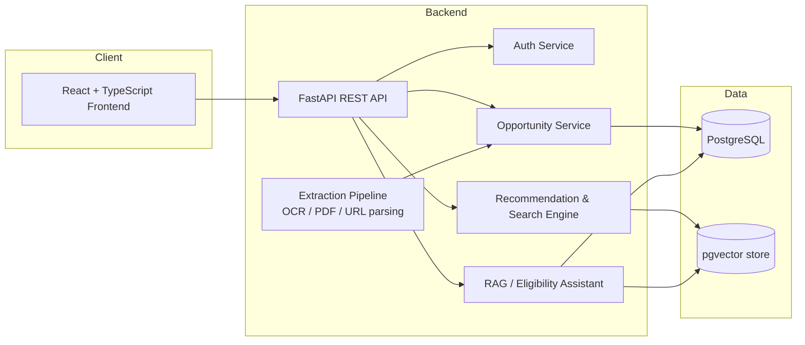

<div align="center">

# OPPURTUNITY-RADAR

**Discover, understand, and track student opportunities — all in one place.**

[]()
[]()

</div>

---

> ⚠️ **Active development.** Opportunity Radar is in early-stage, planning-to-implementation transition. Features described below are a mix of *current scope* and *planned roadmap* — each is labeled clearly. Nothing marked "planned" is implemented yet.

## Overview

Students discover internships, hackathons, scholarships, research openings, competitions, and fellowships from scattered, inconsistent sources — LinkedIn posts, WhatsApp forwards, Instagram posters, PDFs, emails, and college notice boards. There is no single place to search, evaluate eligibility, or track applications.

**Opportunity Radar** aims to be that place: a platform that aggregates opportunities, extracts structured information from unstructured sources (including images and PDFs), and helps students find and track what's relevant to them.

## Problem

| Pain point | Consequence |
|---|---|
| Opportunities are spread across posters, PDFs, emails, and social posts | Students miss relevant openings entirely |
| No standard format for eligibility, deadlines, or requirements | Wasted time verifying basic details |
| No centralized tracking | Missed deadlines, duplicate or forgotten applications |
| Manual filtering by skills, year, or interest | High effort, low signal-to-noise |

## Key Features

### V0.1 Target Scope

- User authentication
- User profiles (skills, interests, graduation year)
- Manual opportunity creation
- Opportunity feed
- Search and filters
- Save opportunities
- PostgreSQL-backed persistence

### Planned features

- Application tracking with status stages
- Deadline tracking and reminder notifications
- Personalized opportunity recommendations
- Duplicate opportunity detection

## AI Capabilities *(planned)*

Opportunity Radar's long-term goal is to turn unstructured opportunity sources into structured, trustworthy data — without inventing facts.

| Capability | Description |
|---|---|
| Poster / screenshot extraction | OCR and multimodal extraction of opportunity details from images |
| PDF and URL parsing | Structured extraction from documents and web pages |
| Structured field extraction | Title, organization, eligibility, deadline, location, mode, skills, team size, application URL |
| Semantic search | Embedding-based search over the opportunity corpus (pgvector) |
| Duplicate detection | Identify and merge re-posted or near-identical opportunities |
| Profile-aware ranking | Recommendations informed by user skills, interests, and year |
| Eligibility assistance (RAG) | Citation-grounded answers to questions like *"Can I apply?"*, *"Is there a CGPA requirement?"*, *"What's the team size?"* |

**Core principle:** the AI layer must never fabricate eligibility, deadlines, fees, or requirements. Answers to consequential questions are grounded in retrieval over original source documents, with citations back to the source.

## Architecture Overview

High-level target architecture. Subject to change as the system evolves.



## Tech Stack

| Layer | Technology |
|---|---|
| Frontend | React, TypeScript |
| Backend | Python, FastAPI, REST APIs |
| Database | PostgreSQL |
| AI / Search | LLMs, OCR, multimodal extraction, embeddings, semantic search, RAG, pgvector |
| Engineering | Git, GitHub, Docker, GitHub Actions, cloud deployment |

## Roadmap

1. Core full-stack platform *(in progress)*
2. Application tracking and reminders
3. AI poster / PDF / link extraction
4. Semantic search with pgvector
5. RAG with citation-grounded answers
6. Eligibility matching
7. Personalized recommendations
8. Duplicate detection
9. Notification system
10. Testing, Docker, CI/CD, analytics, and deployment

## Getting Started

> Setup instructions will be added as the initial V0.1 implementation stabilizes.

<details>
<summary>Planned local setup (placeholder)</summary>

```bash
# Clone the repository
git clone https://github.com/Ranjith-7777/Opportunity-Radar.git
cd Opportunity-Radar

# Backend setup (placeholder)
cd backend
# python -m venv venv && source venv/bin/activate
# pip install -r requirements.txt
# uvicorn main:app --reload

# Frontend setup (placeholder)
cd frontend
# npm install
# npm run dev
```

Environment variables, database migrations, and Docker Compose instructions will be documented here once finalized.

</details>

## Repository Structure

> Placeholder — will be updated once the initial project scaffolding is committed.

```
Opportunity-Radar/
├── backend/        # FastAPI application (planned)
├── frontend/        # React + TypeScript application (planned)
├── docs/             # Architecture and design docs (planned)
└── README.md
```

## Project Principles

- **No fabricated answers.** Eligibility, deadlines, fees, and requirements must be grounded in original source material, not inferred by a language model.
- **Structured over scattered.** Every opportunity should resolve to a consistent, structured record regardless of source format.
- **Transparency of state.** The README and codebase should always reflect what is actually built, not what is planned.
- **Student-first design.** Features are prioritized by how much time and uncertainty they remove for students.

## Contributing

Opportunity Radar is not yet open for external contributions — the core architecture and data model are still being established. A `CONTRIBUTING.md` with setup instructions, coding standards, and issue guidelines will be added once the project reaches a stable initial release.

If you're interested in following along or discussing the project, feel free to open an issue.

## License

Licensed under the [MIT License](LICENSE).

## Author

**Ranjith Raja B**
GitHub: [@Ranjith-7777](https://github.com/Ranjith-7777)

---

<div align="center">

*Opportunity Radar — one place to find, understand, and track every opportunity that matters.*

</div>
